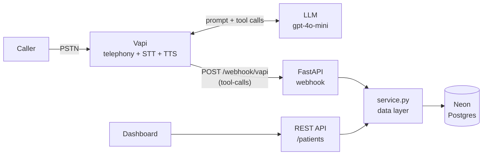

# Voice AI Patient Registration

A phone number you can call to register as a new patient. A voice agent collects
the standard US demographic dataset in conversation, reads it back for
confirmation, writes it to Postgres, and exposes it through a REST API and a web
dashboard.

## Live

| | |
|---|---|
| Phone number | **+1 (434) 256-9374** |
| API base URL | https://carecloud-patient-intake.vercel.app |
| Dashboard | https://carecloud-patient-intake.vercel.app |
| Interactive API docs | https://carecloud-patient-intake.vercel.app/docs |
| Health check | https://carecloud-patient-intake.vercel.app/health |

No credentials are required to view the dashboard or read the API. The only
protected surface is the voice webhook, which requires a shared secret.

The dashboard also has a "Start web call" button that connects to the same
assistant from the browser, which is useful for reviewing the conversation
without placing a phone call.

## Architecture



The voice agent and the REST API share a single data layer. `app/service.py` is
the only module that issues SQL, and both `routes/vapi.py` and
`routes/patients.py` call into it, so a record created by phone and one created
by API pass through the same validation and the same constraints.

```
app/
  main.py             FastAPI wiring, no host-specific code
  db.py               connection pool
  schema.sql          tables, constraints, indexes, triggers
  validators.py       speech normalization and server-side validation
  service.py          the only module that issues SQL
  http.py             response envelope helpers
  routes/patients.py  REST API
  routes/vapi.py      voice webhook (tool calls, end-of-call report)
  prompts/agent.md    system prompt
vapi/assistant.json   assistant and tool definitions
scripts/              migrate, seed, vapi_setup
public/index.html     dashboard
tests/                48 unit and integration tests
run.py                local entry point
api/index.py          Vercel entry point
```

## Tech stack

| Layer | Choice | Reasoning |
|---|---|---|
| Telephony, STT, TTS | Vapi | Handles the audio pipeline and barge-in, leaving the prompt, tool definitions and data model as the work that matters here. |
| LLM | `gpt-4o-mini` via Vapi | Latency matters more than raw capability on a phone call, and slot-filling with tool calls is not a demanding reasoning task. Provider and model are configured in `vapi/assistant.json`. |
| Runtime | Python 3.12+, FastAPI | Async by default, with OpenAPI documentation generated at `/docs`. |
| Database | Neon Postgres via psycopg 3 | Supports the constraints the data model needs (enum, CHECK, partial unique index). A pool with `min_size=0` holds no connection while idle, which suits serverless. |
| Hosting | Vercel | Free tier without a significant cold start. Render's free tier sleeps after 15 minutes and takes roughly 50 seconds to wake, which would be silence on an incoming call. |
| Validation | Hand-written (`validators.py`) | The difficulty is not schema shape but speech: `D-A-V-I-S`, `nine oh two one oh`, `March third, nineteen eighty-five`. Pydantic validates structure but does not normalize dictation. |
| Tests | pytest | 48 tests, run against the real application and database. |

## Data model

`patients` holds the standard minimum demographic dataset. Constraints are
enforced in Postgres as well as in Python.

| Field | Type | Rules | Required |
|---|---|---|---|
| `patient_id` | UUID | generated, primary key | auto |
| `first_name` | varchar(50) | 1-50, alphabetic plus hyphen and apostrophe | yes |
| `last_name` | varchar(50) | 1-50, alphabetic plus hyphen and apostrophe | yes |
| `date_of_birth` | date | valid date, not in the future, 1900 or later | yes |
| `sex` | enum | Male, Female, Other, Decline to Answer | yes |
| `phone_number` | char(10) | US 10-digit, area code `[2-9]` | yes |
| `address_line_1` | varchar(200) | non-empty | yes |
| `city` | varchar(100) | 1-100 | yes |
| `state` | char(2) | valid US state code | yes |
| `zip_code` | varchar(10) | `12345` or `12345-6789` | yes |
| `email` | varchar(254) | valid email format | no |
| `address_line_2` | varchar(100) | apartment, suite or unit | no |
| `insurance_provider` | varchar(100) | | no |
| `insurance_member_id` | varchar(50) | alphanumeric plus hyphen | no |
| `preferred_language` | varchar(50) | defaults to English | no |
| `emergency_contact_name` | varchar(100) | | no |
| `emergency_contact_phone` | char(10) | US 10-digit | no |
| `source` | varchar(20) | voice, api or seed | auto |
| `call_id` | varchar(100) | call identifier, used for idempotency | auto |
| `created_at`, `updated_at` | timestamptz | `updated_at` maintained by trigger | auto |
| `deleted_at` | timestamptz | soft-delete marker | auto |

`call_logs` holds one transcript per call, linked to the patient it produced.

## REST API

Every response uses the same envelope on both success and failure:

```json
{ "data": { ... }, "error": null }
{ "data": null,    "error": { "message": "...", "details": [ ... ] } }
```

| Method | Endpoint | Notes |
|---|---|---|
| `GET` | `/patients` | filters: `?last_name=` `?date_of_birth=` `?phone_number=`, plus `?limit=` `?offset=` |
| `GET` | `/patients/{id}` | 400 for a non-UUID, 404 if unknown |
| `POST` | `/patients` | 201 on success, 422 with per-field detail on validation failure |
| `PUT` | `/patients/{id}` | partial update |
| `DELETE` | `/patients/{id}` | soft delete, sets `deleted_at` and retains the row |
| `GET` | `/health` | liveness and configuration check |
| `GET` | `/calls` | recent call transcripts |
| `GET` | `/docs` | interactive OpenAPI documentation |
| `POST` | `/webhook/vapi` | voice webhook, requires `x-vapi-secret` |

Status codes in use: 200, 201, 400, 404, 422, 500.

Filters are normalized the same way stored values are, so
`?phone_number=(415) 555-0192` and `?phone_number=4155550192` both match, and
`?last_name=` is case-insensitive.

```bash
# Create
curl -X POST "$API/patients" -H 'content-type: application/json' -d '{
  "first_name": "Maria", "last_name": "Obrien",
  "date_of_birth": "03/03/1990", "sex": "Female",
  "phone_number": "(415) 555-0192",
  "address_line_1": "77 Market St", "city": "San Francisco",
  "state": "California", "zip_code": "94103"
}'

# Search, update, soft-delete
curl "$API/patients?last_name=obrien"
curl -X PUT "$API/patients/<id>" -H 'content-type: application/json' -d '{"city":"Oakland"}'
curl -X DELETE "$API/patients/<id>"
```

In that example `"California"` is stored as `CA` and the formatted phone number
as `4155550192`. The normalization that makes the voice agent robust also
applies to API input.

## Voice agent

### Tools

| Tool | Called | Returns |
|---|---|---|
| `lookup_patient` | after the greeting, using caller ID | `MATCH_FOUND` with the record, or `NO_MATCH` |
| `save_patient` | after the caller confirms the readback | `SAVED`, `VALIDATION_FAILED` or `SAVE_FAILED` |
| `update_patient` | when a returning caller changes details | `UPDATED`, `VALIDATION_FAILED` or `UPDATE_FAILED` |

### Tool results are spoken instructions

A tool result is the text the model reads next, not a status code, so each one
is written as an instruction the agent can act on:

```
VALIDATION_FAILED. The record was NOT saved. Problems:
- date_of_birth: date_of_birth must be a real date in the past (MM/DD/YYYY).
  Ask the caller to repeat their date of birth, including the four-digit year.

Apologise briefly, ask the caller only about the fields listed above, then
call save_patient again with the full set of information.
```

This covers several failure modes at once. An invalid date of birth re-prompts
for that field alone, a database failure produces an apology rather than
silence, and the agent does not have to improvise an error-handling policy at
runtime.

The webhook always returns HTTP 200, including on internal failure. A 5xx would
cause Vapi to retry, and a retry during a live call is worse than a dropped
event.

### Prompt

The system prompt is in [`app/prompts/agent.md`](app/prompts/agent.md), version
controlled alongside the code, with maintainer notes in HTML comments that are
stripped before it is sent. It covers persona and speech style, the call flow,
and handling for corrections, interruptions, out-of-order answers, restarts,
unclear audio, Spanish, and refusals.

### Speech normalization

Prompt instructions alone do not reliably correct transcription artifacts, so
this is handled in code and unit tested:

| Caller says | Transcriber produces | Stored |
|---|---|---|
| spells their name | `d-a-v-i-s` | `Davis` |
| a hyphenated name | `smith-jones` | `Smith-Jones` |
| a date | `March 3, 1990` or `3rd of March, 1990` | `1990-03-03` |
| a state | `California` | `CA` |
| a ZIP, digit by digit | `nine four one zero three` | `94103` |
| a phone number | `+1 (415) 555-0192` | `4155550192` |
| an email | `john dot smith at gmail dot com` | `john.smith@gmail.com` |
| their sex | `f`, `prefer not to say` | `Female`, `Decline to Answer` |

## Running it

### Local

```bash
python -m venv .venv
.venv/Scripts/activate            # Windows; source .venv/bin/activate elsewhere
pip install -r requirements-dev.txt

cp .env.example .env              # fill in DATABASE_URL and VAPI_WEBHOOK_SECRET
python scripts/migrate.py         # create tables
python scripts/seed.py            # two demo patients
python run.py                     # http://localhost:3000
pytest                            # 48 tests
```

### Deploy

1. Push to GitHub.
2. Import the repository at [vercel.com/new](https://vercel.com/new).
3. Add the environment variables listed below under Settings, Environment
   Variables.
4. Set Framework Preset to "Other". Vercel's framework detection otherwise
   applies a preset that selects its own server entry point and claims the `/`
   route, which prevents the dashboard from loading. `framework: null` in
   `vercel.json` sets this, but a preset detected at import time takes
   precedence.
5. Deploy. Vercel serves the dashboard from `public/` and routes everything
   else to `api/index.py` through the rewrite in `vercel.json`. The rewrite
   pattern requires at least one path character so `/` is not captured.
6. Under Settings, Deployment Protection, set Vercel Authentication to
   Disabled. Otherwise the API and the voice webhook sit behind an SSO redirect
   and cannot be reached externally.

`python scripts/migrate.py` is run once from a local machine against the same
database; the schema does not need to be applied from the deployed instance.

### Environment variables

| Variable | Required | Purpose |
|---|---|---|
| `DATABASE_URL` | yes | Postgres connection string |
| `VAPI_WEBHOOK_SECRET` | yes | shared secret, must match the Vapi tool header |
| `PUBLIC_BASE_URL` | setup only | used by `scripts/vapi_setup.py` |
| `VAPI_PRIVATE_KEY` | setup only | used by `scripts/vapi_setup.py` |
| `VAPI_PUBLIC_KEY` | no | enables the dashboard web-call button |
| `VAPI_ASSISTANT_ID` | no | enables the dashboard web-call button |
| `PUBLIC_PHONE_NUMBER` | no | displays the number on the dashboard |

No secret is committed. `.env` is gitignored and nothing is hardcoded.

### Configuring the voice agent

Apply the checked-in configuration:

```bash
python scripts/vapi_setup.py     # creates or updates the assistant
```

The same can be done by hand in the Vapi dashboard: create an assistant, paste
[`app/prompts/agent.md`](app/prompts/agent.md) (below the `---`) as the system
message, add the three tools using the schemas in
[`vapi/assistant.json`](vapi/assistant.json), point each tool's server URL at
`https://<your-app>/webhook/vapi` with the `x-vapi-secret` header, enable the
`tool-calls` and `end-of-call-report` server messages, then attach a phone
number.

## Edge cases handled

| Scenario | Behaviour |
|---|---|
| Invalid date of birth (future, `02/31`, no year) | rejected server-side; the agent re-prompts for that field only |
| Three-digit phone number | rejected; the agent asks for the number one digit at a time |
| Caller corrects a spelling mid-call | the prompt instructs the agent to accept it, confirm that item, and continue |
| Caller asks to start over | the prompt instructs the agent to discard and restart from the name |
| Caller interrupts the agent | barge-in via `stopSpeakingPlan`, plus a prompt rule to resume mid-thought |
| Answers arrive out of order | the prompt instructs the agent to keep the answer and skip that question later |
| Database write fails | the agent apologises, promises a callback and ends politely |
| A tool call is repeated | the partial unique index on `call_id` makes the second insert a no-op |
| Call drops mid-conversation | the end-of-call report still stores the transcript |
| Unknown tool name from the model | returns a usable instruction rather than a 500 |
| Malformed JSON body | 400 in the standard envelope rather than FastAPI's default 422 |
| Non-UUID in a path parameter | 400 rather than a database error |
| `DATABASE_URL` missing on a deployment | `/health` returns 503 naming the missing variable |

## Known limitations

- `PUT` cannot clear an optional field. Partial updates use `COALESCE`, so
  omitting a field leaves it unchanged and there is no way to set it back to
  null. A `PATCH` with explicit-null semantics would address this.
- The REST API is unauthenticated. The voice webhook is not. A production
  deployment would need authentication, rate limiting and audit logging on
  every route.
- Not HIPAA compliant. There is no BAA, no access control and no encryption at
  rest beyond what the database provides. No real patient data should be
  entered.
- Duplicate detection keys on phone number alone, so two family members sharing
  a number will collide. The agent asks before assuming, but matching on name
  and date of birth as well would be more reliable.
- English and Spanish only, and Spanish is a prompt instruction rather than a
  tested path.
- The webhook reads several possible payload shapes (`toolCallList`,
  `toolCalls`, `functionCall`) because that field has changed across Vapi
  releases. `_extract_tool_calls` in `app/routes/vapi.py` is the single place
  to update if it changes again.
- The database scales to zero on the free tier, so the first query after an
  idle period takes about a second. Subsequent queries are single-digit
  milliseconds.

## Next steps

1. Appointment scheduling after registration.
2. `PATCH` with explicit-null semantics, and an audit trail of field changes.
3. API authentication and per-IP rate limiting.
4. Insurance eligibility verification against a payer API.
5. A confirmation SMS with the registered details.
6. Duplicate detection on name and date of birth rather than phone alone.

## Testing

```bash
pytest
```

48 tests. The integration tests run the real FastAPI application against the
real database and clean up after themselves.

- Unit tests cover every normalizer and the validator in full and partial modes.
- API tests cover CRUD, all filters, every status code, and soft-delete
  semantics (hidden from reads, row retained, second delete returns 404).
- Webhook tests cover authentication, `lookup_patient` match and no-match,
  `save_patient` success and validation re-prompt, repeated tool calls, tool
  arguments arriving as a JSON string, unknown tool names, and transcript
  persistence from the end-of-call report.
